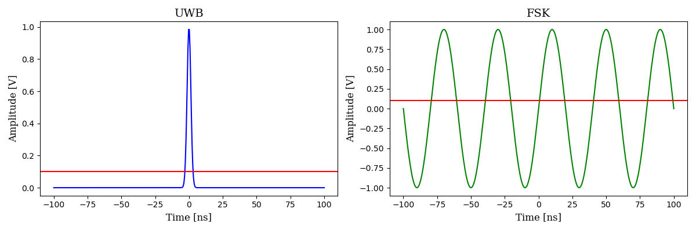
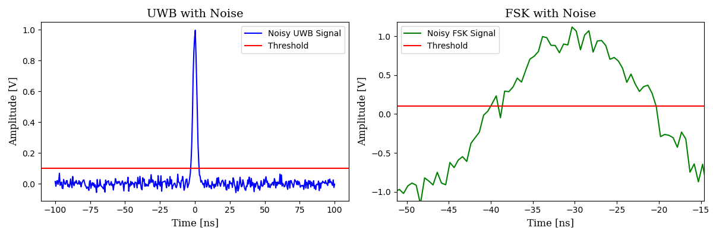
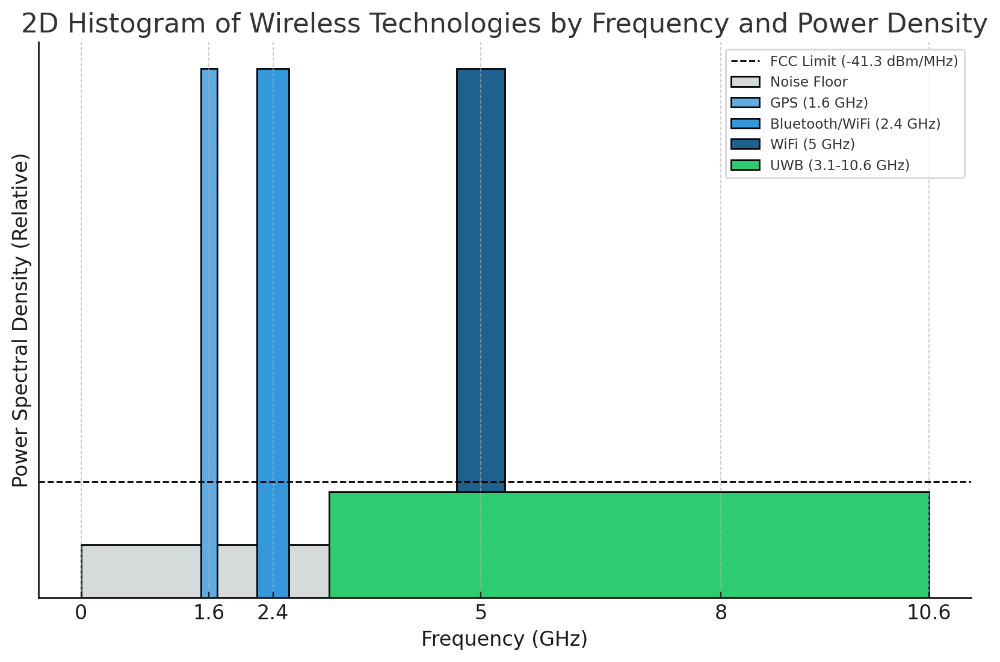

# Ultrawideband (UWB) Primer

## Introduction
Ultra Wide Band (UWB), also known as impulse radio, is a radio technology that uses short pulses instead of periodic signals. These short radio pulses result in a bandwidth of several hundred megahertz, giving UWB its name.

## Advantages of UWB Pulses
UWB pulses allow the arrival time of the signal to be determined with greater precision compared to conventional narrowband signals. In a real-world scenario, signals are often subject to noise, but with a defined threshold, the arrival time of a UWB pulse can be clearly identified when the signal surpasses this threshold.
With conventional narrowband signals the threshold may be crossed multiple times due to the noise, thus implying imprecision in determining the real moment the threshold is met.

### Key Points
- **Precision**: The exact time at which the UWB pulse arrives is easily identifiable.
- **Noise Resistance**: UWB pulses are less affected by noise, making them well-suited for applications that require accurate timing and ranging.

## UWB vs Other Wireless Technologies
UWB’s pulse shape is designed to spread across a broad spectrum (500 MHz+), avoiding frequency peaks and maintaining a uniform spectrum. This design allows UWB signals to coexist with other radio technologies without interference, as UWB signals appear as background noise to narrowband systems.

## UWB Ranging Use Cases

### UWB Ranging
UWB ranging is the process of determining the distance between two UWB devices using the time-of-flight (ToF) of radio signals. The main steps are:
1. **Pulse Transmission**: One UWB device sends a short-duration pulse.
2. **Time-of-Flight Measurement**: The time it takes for the pulse to reach the receiver is measured.
3. **Distance Calculation**: Given the known speed of radio waves (approximately the speed of light), the distance can be calculated based on ToF.

## UWB Ranging Modes
When designing a Real-Time Location System (RTLS) with UWB, several configuration options are available, each with advantages and limitations regarding communication efficiency and power consumption. The primary options are:

- **Single-Sided Two-Way Ranging (SS-TWR)**
- **Double-Sided Two-Way Ranging (DS-TWR)**
- **Time Difference of Arrival (TDOA)**
- **Downlink TDOA**

Each option is suitable for different scenarios, depending on the application's specific requirements for accuracy, power consumption, and system complexity.

---

## Detailed UWB Ranging Modes and Use Cases

### 1. Single-Sided Two-Way Ranging (SS-TWR)
In SS-TWR, the following steps occur:
1. **Initiation**: A device sends a signal to a responder.
2. **Response**: The responder receives the signal and replies after a fixed delay.
3. **Calculation**: The initiator calculates the distance based on the round-trip time and the known speed of the signal.

              A                                      B
       +---------+                           +---------+
       |   TX_A  |-------------------------> |   RX_B  |
       +---------+         poll              +---------+
          |                                        |
          |                                        |
        deltaLoop                               deltaReply
          |                                        |
          v                                        |
       +---------+         response           +---------+
       |   RX_A  | <------------------------- |   TX_B  |
       +---------+                            +---------+

        Initiator (A)                          Responder (B)

     $ToF(A,B) = \frac{(deltaLoop - deltaReply)} {2}$

**Pros**:
- Lower power consumption compared to DS-TWR.
- Simple setup suitable for applications with minimal power requirements.

**Cons**:
- Less accurate due to the clock drift between the 2 devices.

---

### 2. Double-Sided Two-Way Ranging (DS-TWR)
DS-TWR improves accuracy by performing two exchanges between the initiator and responder:
1. **First Exchange**: The initiator sends a signal and the responder replies after a fixed delay.
2. **Second Exchange**: The initiator waits and sends another signal to the responder.

This helps removing the effect of clock drifts between the two devices

              A                                      B
       +---------+                           +---------+
       |   TX_A  |-------------------------> |   RX_B  |
       +---------+         poll              +---------+
          |                                        |
          |                                        |
        deltaLoopA                              deltaReplyB
          |                                        |
          v                                        |
       +---------+      poll + response        +---------+
       |   RX_A  | <-------------------------  |   TX_B  |
       +---------+                             +---------+
          |                                        |
          |                                        |
        deltaReplyA                             deltaLoopB
          |                                        |
          v                                        |
       +---------+          response           +---------+
       |   TX_A  |---------------------------> |   RX_B  |
       +---------+                             +---------+

        Initiator (A)                          Responder (B)

    $ToF(A,B) = \frac{(deltaLoopA * deltaLoopB - deltaReplyA * deltaReplyB)} {(deltaLoopA + deltaLoopB + deltaReplyA + deltaReplyB)}$

**Pros**:
- Higher accuracy than SS-TWR due to reduced error from processing time.
- Suitable for applications where accuracy is crucial.

**Cons**:
- Higher power consumption than SS-TWR due to additional exchanges.

DS-TWR adapts to a very large set of use cases, including those where UWB-enabled smartphones are involved:

| **Hands-Free Access Control**     | **Smart Home and Enterprises**                | **Smart Cities and Mobility**       | **Consumer**                | **Smart Retail**                 | **Industrial and Healthcare**         |
|-----------------------------------|-----------------------------------------------|-------------------------------------|------------------------------|----------------------------------|---------------------------------------|
|                                   | • Residential access control                  | • Smart parking garage             | • Logical access control     | • Unmanned store access          | • Barrier-free and restricted         |
|                                   | • Restricted enterprise access               | • Keyless car access (CCC standard)|                              |                                  |   access control                     |
| **Location-Based Services**       | • Employee mustering in emergencies          | • Ride sharing                     | • AR gaming                  | • Indoor navigation              | • Asset tracking                      |
|                                   |                                               | • Bike sharing                     |                              | • Foot traffic and shopping      | • Patient tracking                    |
|                                   |                                               |                                    |                              |   behavior analytics             |                                       |
| **Device-to-Device (Peer-to-Peer) Services** | • Smart conference systems                | • Drone-controlled delivery        | • VR gaming and group play   | • Targeted marketing             | • Proximity-based patient data sharing|
|                                   |                                               | • V2X, autonomous driving          | • Find someone nearby        |                                  | • Find equipment                      |

---

### 3. Time Difference of Arrival (TDOA)
In TDOA, the difference in the arrival times of signals from the same device at different receivers is measured. This method requires at least three synchronized receivers. The synchronization mechanism is implemented by configuring one of the anchors as a synchronization master. Tags are configured to transmit very short messages (also known as Blinks) which are received by the anchors. The anchors then transmit the blinks and the sync data (with related tag/anchor identification data and transmission and reception timestamps) to a RTLS engine via an out-of-band mechanism.
The RTLS engine provides for clock drift compensation (via the sync information from the master anchor) and the triangulation operations that use the clock-compensated timestamps to calculate the position of the tag

                            +--------------------------+
                            | RTLS Engine &            |
                            | Network Management       |
                            +--------------------------+
                                  ^     ^      ^
                                  |     |      |
                             ------    -----   -----
                            |            |           |
               +----------+        +----------+         +----------+
               |          |        |          |         |          |
               |  Slave   +        +  Master  +         +  Slave   |
               |  Anchor  |        |  Anchor  |         |  Anchor  |
               +----------+        +----------+         +----------+
                    ^                  ^                    ^
                    |                  |                    |
                    |                  |                    |
                   Blinks emitted from the TDoA Tag towards each Anchor
                                  
                                   +---------+
                                   |  TDoA   |
                                   |   Tag   |
                                   +---------+

**Pros**:
- Ideal for environments where multiple devices need to be tracked simultaneously.
- Can handle large-scale tracking in real-time.

**Cons**:
- Requires precise synchronization between receivers, which can increase system complexity.
- Requires an out-of-band infrastructure

This configuration is typically used for applications covering high density industrial and
logistics use cases

---

### 4. Downlink TDOA
Downlink TDOA involves a network of synchronized anchors sending signals to a mobile device, which calculates its location based on the time differences of the signals. The mobile device is configured in a special mode (DL-TDoA Tag) where it is setup to just listen to the ranging sessions happening between the anchors. By acquiring information about these rangings (IDs and TX/RX timestamps) and given the position of the anchors, the Tag can calculate it's own position without the need for a centralized infrastructure

                       +----------+       +----------+
                       | Responder| <---> | Responder|
                       |  Anchor  |       |  Anchor  |
                       +----------+       +----------+
                            ^                     ^
                            |                     |
                            |       +--------+    |
                            |       | DLTDoA |    |
                            |       |   Tag  |    |
                            |       +--------+    |
                            |                     |
                            v                     v
                       +----------+       +----------+
                       | Initiator| <---> | Responder|
                       |  Anchor  |       |  Anchor  |
                       +----------+       +----------+

**Pros**:
- Reduces computation load on the network, as the device itself determines its location.
- Efficient for applications where many devices need to calculate positions without high infrastructure demands. Adding more Tags does not increase the network traffic because Tags 'just listen' to the Anchors' rangings

**Cons**:
- Requires the mobile device to handle calculations, potentially increasing device power usage.

This configuration is typically used when an asset (e.g. AGVs , drones etc) must be able to
determine its own position in the field in realtime and without the need for a complex
infrastructure.

## Summary

| Method   | Scalability | Power Consumption | Network Architecture                         | Use Cases
|----------|-------------|-------------------|----------------------------------------------|-------------
| DS-TWR   | Low         | High              | Anchor to Location Server (optional)         | Many (see table above)
| TDOA     | High        | Low               | Anchor to Triangulation/Synchro Server       | Industrial and Logistics Realtime Location Servers
| DL-TDOA  | Very High   | High              | Tag to Location Server (optional)            | AGV, Drones, Robots

